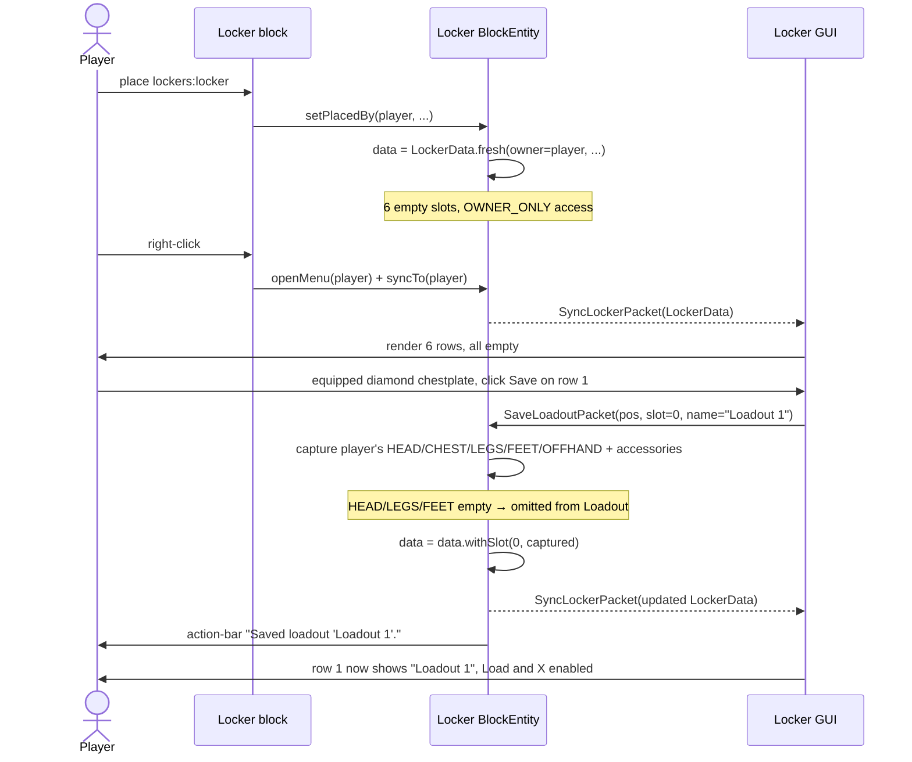
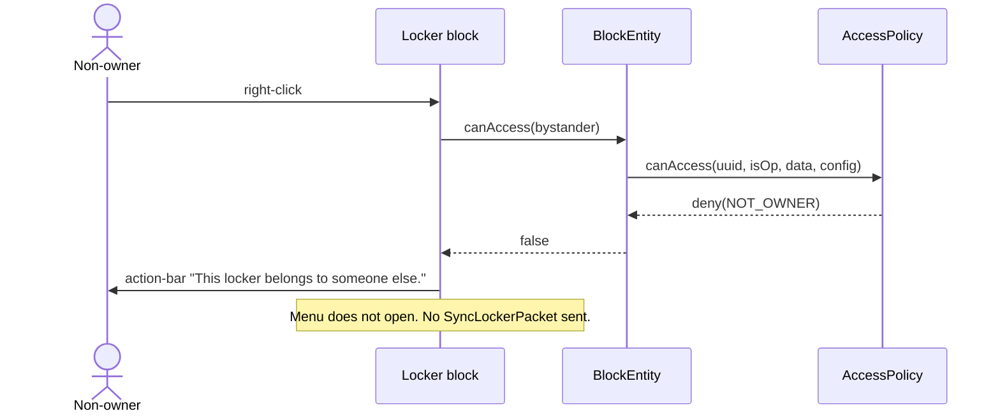
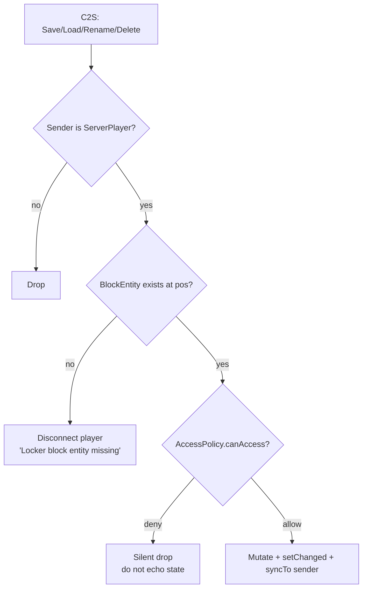

# Lockers — UX reference

Snapshot of the user-facing behavior. Use this doc to review what the mod
actually does, identify gaps, and lock down decisions before each release
to CurseForge.

The diagrams below render on GitHub (Mermaid + ASCII).

## Decisions locked in v0.1.0-alpha.2

The 🚩 questions originally flagged in the v0.1.0-alpha.1 version of this
doc have been resolved in the listed direction:

| # | Decision | Status |
| - | -------- | ------ |
| 1 | Both vanilla and accessory loadouts use **MERGE** semantics (only saved slots are touched on Load) — combined with **MOVE** in 0.1.0-alpha.3 (Save takes gear off the player; Load takes gear out of the slot, slot becomes empty) | ✅ shipped |
| 2 | Save-onto-populated-slot requires confirm (button flips to "Confirm?" for 2 s) | ✅ shipped |
| 3 | Delete requires confirm (button flips to "?" for 2 s) | ✅ shipped |
| 4 | Broken Locker drops a Locker item carrying its saved loadouts via `CUSTOM_DATA`; new placer becomes owner | ✅ shipped |
| 5 | Concurrent viewers — status quo (only the mutating player gets a fresh sync) | accepted |
| 6 | Public/Private toggle in the GUI, owner-only | ✅ shipped |
| 7 | Empty saves are rejected with "Nothing to save..." action-bar message | ✅ shipped |
| 8 | NBT size — status quo (no cap) | accepted |

---

## 1. Screens

### 1.1 The Locker GUI

What the player sees when they right-click a Locker they own (current build):

```
+---------------------------------------------------------------+
| Locker                                                        |
|                                                               |
| 1: [____________________]   [ Save ] [ Load ] [X]             |
| 2: [____________________]   [ Save ] [ Load ] [X]             |
| 3: [____________________]   [ Save ] [ Load ] [X]             |
| 4: [____________________]   [ Save ] [ Load ] [X]             |
| 5: [____________________]   [ Save ] [ Load ] [X]             |
| 6: [____________________]   [ Save ] [ Load ] [X]             |
|                                                               |
+---------------------------------------------------------------+
   ^             ^                ^        ^         ^
   |             |                |        |         |
 row #         name field      save button load btn  delete
```

**Empty state for an unused slot** — name field is blank and disabled,
`Load` and `X` are greyed out, `Save` is enabled:

```
1: [                    ]   [ Save ] [ Load ] [X]
                              ^^^^    ^^^^^^   ^^^
                              active  disabled disabled
```

**Populated state** — name field shows the loadout name (editable), all
three buttons are active:

```
2: [Mining gear        ]   [ Save ] [ Load ] [X]
   ^                         ^^^^    ^^^^    ^^^
   editable; Enter / focus-  active  active  active
   out fires Rename packet
```

### 1.2 What's NOT in the GUI yet

- No texture art — the panel is a flat dark rectangle with hairline borders.
- No icon next to the name (the plan called for a chestpiece thumbnail).
- No access-control toggle (OWNER_ONLY ↔ PUBLIC must be set via server config).
- No confirmation when overwriting a populated slot.
- No confirmation when deleting.
- No display of "what's saved" (chest icon, item count).

---

## 2. Action reference

Every clickable / typeable surface, what packet it fires, and what the server does.

| UI element             | Trigger                  | Packet              | Server-side outcome |
| ---------------------- | ------------------------ | ------------------- | ------------------- |
| Right-click Locker     | (block use)              | (none, vanilla)     | Owner check → open menu → push `SyncLockerPacket`. Non-owners see "This locker belongs to someone else." in the action bar and the menu does not open. |
| Name field (typing)    | Each keystroke           | (none)              | Local-only until Enter or focus-out. |
| Name field — Enter     | `Enter` / `Numpad Enter` | `RenameLoadoutPacket` | Validate access → if value differs from server's name and slot is populated, replace the slot's `Loadout.name`. Sync back. |
| Name field — focus-out | Click outside the field  | `RenameLoadoutPacket` | Same as Enter. |
| `[Save]` button        | Click                    | `SaveLoadoutPacket` | Capture player's 4 armor slots + offhand + accessories → write into the slot. Auto-name = "Loadout *N*" if the field was blank. **Silent overwrite of existing loadouts.** |
| `[Load]` button        | Click (only if populated) | `LoadLoadoutPacket` | Apply the loadout to the player. Returns previously-equipped items to the main inventory (drops on the floor if full). See open question 🚩 #1 for how vanilla vs accessory slots differ. |
| `[X]` button           | Click (only if populated) | `DeleteLoadoutPacket` | Clear the slot. **No confirmation.** |
| Place locker          | Right-click locker item   | (none)              | Owner = placing player. `LockerData.fresh(...)` stamped on `setPlacedBy`. |
| Break locker          | Mine the block            | (none)              | Drops the locker item. **All saved loadouts are lost.** Ownership and slots do not migrate to the dropped item. |

---

## 3. User flows

### 3.1 First-time use (place + save first loadout)



### 3.2 Swap loadouts mid-fight

```mermaid
sequenceDiagram
    actor Player
    participant BE as Locker BlockEntity
    participant Inv as Player inventory

    Player->>BE: click Load on slot 2 ("PvP")
    BE->>Inv: read current armor + accessories
    BE->>Inv: clear current accessories (return to main inv)
    Note over BE: Vanilla armor slots: only replaced if loadout has them<br/>(missing slots left alone — see 🚩 #1)
    BE->>Inv: install saved armor stacks; old armor → main inv
    BE->>Inv: install saved accessory stacks; if main inv full, drop on floor
    BE-->>Player: action-bar "Loaded loadout 'PvP'."
```

### 3.3 Rename a loadout

```mermaid
sequenceDiagram
    actor Player
    participant Screen as Locker GUI
    participant BE as Locker BlockEntity

    Player->>Screen: click name field on populated slot
    Screen->>Screen: focus EditBox, capture caret
    Player->>Screen: type "Mining gear"
    Note over Screen: local edits only; no packets yet
    Player->>Screen: press Enter (or click outside the field)
    Screen->>BE: RenameLoadoutPacket(pos, slot, "Mining gear")
    BE->>BE: data = data.withSlot(slot, loadout.withName("Mining gear"))
    BE-->>Screen: SyncLockerPacket
    Screen->>Player: row N now shows "Mining gear"
```

### 3.4 Non-owner attempts access



### 3.5 Server-side packet validation (defense-in-depth)

The client UI gates the [Load] and [X] buttons on slot population, but a
modified client could still fire any packet at any time. Server-side checks:



---

## 4. 🚩 Open questions for the maintainer

Each of these is a real choice the current code makes that you may want to override. None block the alpha — but locking them down before tagging means the first impression players get is the deliberate one.

### 🚩 #1 — Vanilla equipment uses **merge**, accessories use **clear-then-apply**. Pick one.

**Current behavior:**
- *Vanilla armor + offhand:* If a saved loadout has chest only, [Load] sets the chest and **leaves head/legs/feet/offhand untouched.**
- *Curios + Accessories:* [Load] **clears every accessory slot** before re-installing the saved ones, even slots the loadout never touched.

These are visibly inconsistent. The Rust source material is closer to clear-then-apply for everything ("the locker fully replaces your kit"). The merge version is friendlier for power users ("save just my netherite chest separately from my full kit").

**Options:**
1. **Both clear-then-apply** (Rust-faithful) — predictable, drops "swap chest only" use cases.
2. **Both merge** — power-user-friendly, can be confusing ("I loaded my pvp set but I'm still wearing my mining helmet").
3. **Status quo (split)** — fastest to ship but documenting it as intentional is a stretch.
4. **Player toggle per slot** — too much complexity for v0.1.

My recommendation: **#1 (both clear-then-apply)**. It matches the source material and the "kit swap" mental model. Users who want partial saves can leave items in their inventory and use multiple slots.

### 🚩 #2 — Save silently overwrites a populated slot. Confirm or no?

**Current:** click [Save] on slot 2, even if "PvP" is already in there, it gets replaced with whatever you're wearing now. No undo.

**Options:**
1. Status quo (silent overwrite) — fastest UX, easy to lose work.
2. Confirm with a "click again to overwrite" gate (button label flips to `Confirm?` for 2 seconds).
3. Modal "Overwrite 'PvP'? [Yes] [No]".

Modpacks I've seen converge on #2 for destructive operations. Cheap to implement.

### 🚩 #3 — Delete is a single click. Confirm or no?

**Current:** click [X], slot wiped instantly.

Same options as #2. Same recommendation: **#2 (button-flips-to-confirm)** — visually warns without breaking flow.

### 🚩 #4 — Loadouts vanish when the Locker is broken.

**Current:** breaking the block drops a `lockers:locker` item with no NBT data. The 6 saved loadouts are lost.

**Options:**
1. Status quo — simple, but a single grief swing destroys the player's progression.
2. Drop a Locker item that carries the saved data (NBT on the item, restored on next placement).
3. Refuse to break the block unless the loadouts are all empty.
4. Make the block unbreakable by anyone except the owner (fits OWNER_ONLY anyway).

**#2** is what most furniture-mod equivalents do. **#4** is what Rust does (lockers are deployed structures, not survival blocks). For the alpha I'd ship #1 and revisit; for v1.0 I'd want #2 or #4.

### 🚩 #5 — Two players opening the same Locker simultaneously won't see each other's mutations.

**Current:** `BlockEntity.syncTo(player)` only pushes the new state to the *player who triggered the mutation*. If players A and B both have the menu open and A clicks [Save], B's screen still shows the pre-save state.

**Options:**
1. Status quo — minor staleness, server is still authoritative.
2. Track a per-Locker `Set<UUID> currentViewers` and broadcast `SyncLockerPacket` to all of them.
3. Don't allow concurrent access — when A opens, B is denied.

Real-world impact is small (Lockers are typically owner-only, so concurrent viewers are rare); but for `PUBLIC` lockers on multiplayer servers, **#2** is worth the small complexity bump.

### 🚩 #6 — Access control (OWNER_ONLY / PUBLIC) is server-side config, not in the GUI.

**Current:** `AccessControl` lives in `LockerData` and is part of `LockerData.fresh(...)` defaults. The server can set `defaultAccess` in `CommonConfig`, but a player has no way to flip an *individual* locker between OWNER_ONLY and PUBLIC after placement.

A `RenameLoadoutPacket`-style "ChangeAccessPacket" plus an owner-only toggle in the GUI (hidden from non-owners) would round this out. Not strictly needed for the alpha, but the architecture is already in place server-side.

**Recommendation:** add a small `[ Public 🔓 / Private 🔒 ]` toggle in the top-right of the GUI, owner-only, gated server-side via `AccessPolicy.canModifyAccess(...)` (already exists, currently has no caller).

### 🚩 #7 — Empty save creates an empty Loadout. Allow or reject?

**Current:** click [Save] while wearing nothing → a Loadout with empty `equipment` and empty `accessories` is created. Loading it is a no-op for vanilla equipment (per #1's merge semantics) and clears all accessories (per current Curios behavior).

**Options:**
1. Allow — useful for "strip naked" loadouts (mining-while-naked-for-EFR builds, swimming meta).
2. Reject — show "nothing to save" in the action bar.

I'd allow it. Edge case but the architecture already handles it cleanly.

### 🚩 #8 — Loadouts have no expiration / size limit beyond the 6-slot ceiling.

A Locker can theoretically hold 6 fully-NBT'd item stacks per slot × 6 slots = 36 ItemStacks worth of NBT in a single chunk's BE. With heavily-enchanted netherite + Curios, that's nontrivial. Not a near-term concern, but worth flagging as we approach v1.0.

---

## 5. Things that are NOT yet decided but probably should be before CurseForge

These aren't in the code at all, but reviewers and users will ask:

- **Cosmetic vs functional accessory slots.** Curios has cosmetic slots. The current bridge ignores them. Should the locker save cosmetics separately, save them merged, or skip them entirely? (Recommendation: skip cosmetics for v0.1, save+restore in v0.2.)
- **What happens when a saved item references a now-removed mod / item?** Currently `ItemStack.parseOptional` returns `EMPTY` on parse failure. The loadout silently has fewer items after an item gets deleted from a modpack. We could detect this and show "[?] 2 items missing" to the player on load.
- **Recipe gating.** The Locker is craftable from 8 iron + 1 diamond. Is that the right cost for a "save your gear" power tool? Modpack authors will rebalance, but the default matters for first impressions.
- **Should the Locker show the loadout's chestplate icon** (per the original plan)? Currently just the name. Adding the icon means rendering an `ItemStack` next to each row — straightforward but it's the kind of UX-polish the screenshots will hinge on.

---

When you've made calls on the 🚩 items, point me at the list and I'll implement the changes.
